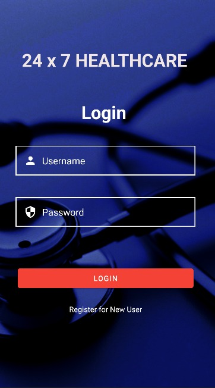
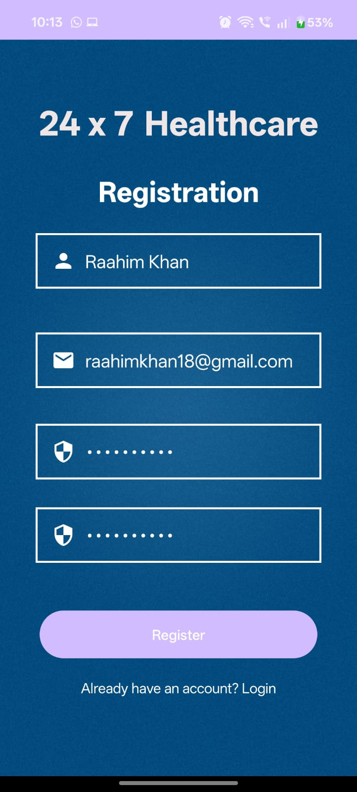
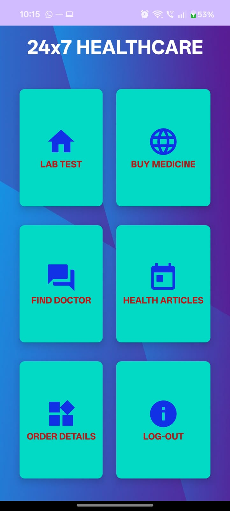
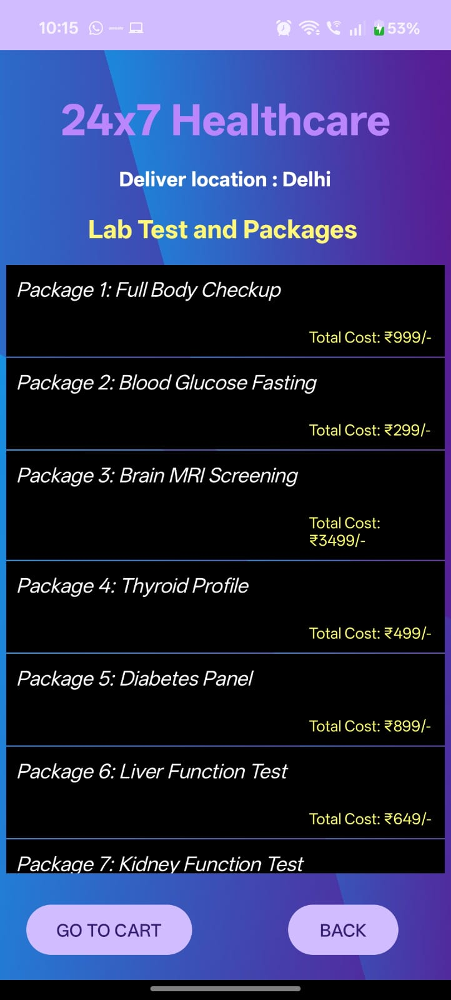
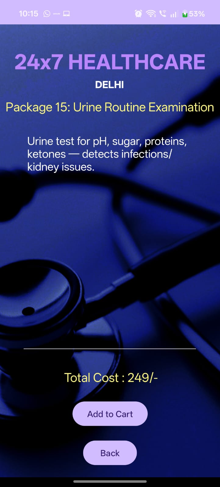
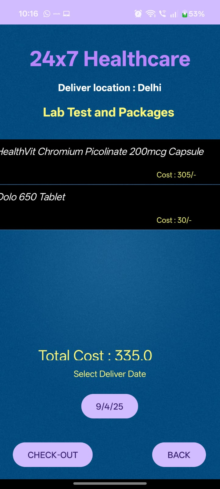
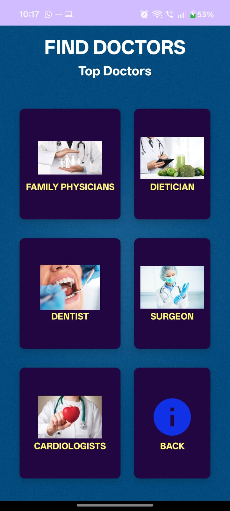

# 24x7 Healthcare 🏥

<p align="center">
  
</p>

24x7 Healthcare is an Android application that allows users to book lab tests, buy medicines, read useful health articles, and consult doctors anytime, anywhere.  
The app works **offline** and stores user data & bookings securely using **SQLite**.

---

## 📱 App Features

| Feature | Description |
|--------|-------------|
| 🔑 User Login & Registration | Secure authentication system |
| 🧪 Lab Test Booking | Browse test packages and order easily |
| 💊 Buy Medicines | Add medicines to cart and checkout |
| 👨‍⚕️ Find Doctors | Browse doctor categories and view specialists |
| 📦 Order & Delivery Tracking | Stored locally in SQLite |
| 🎨 Clean & Modern UI | Smooth navigation and interactive screens |

---

## 🛠 Tech Stack

| Technology | Purpose |
|-----------|---------|
| **Java / Kotlin** | App development |
| **XML** | UI layout design |
| **SQLite** | Local storage (orders & appointments) |
| **Android Studio** | IDE |

---

## 📸 Screenshots

| Login | Registration | Home |
|------|-------------|------|
|  |  |  |

| Lab Test Packages | Test Details | Checkout |
|------|-------------|------|
|  |  |  |

| Booking Form | Find Doctors |
|-------------|-------------|
|  |  |


---

## 🚀 How to Run

```bash
git clone https://github.com/raahimkhan18/24x7Healthcare.git
